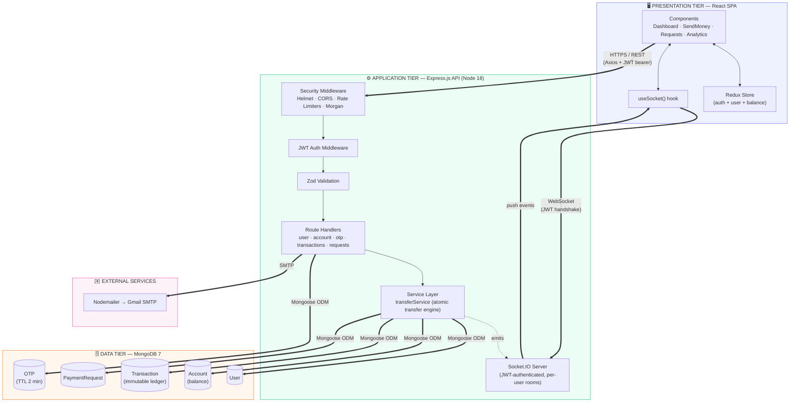
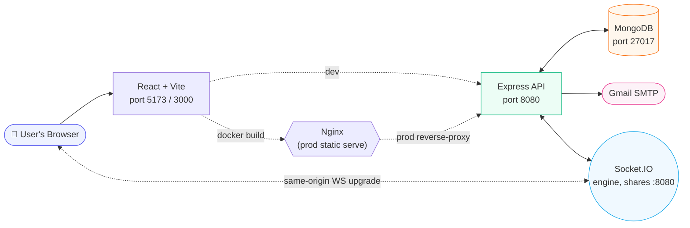
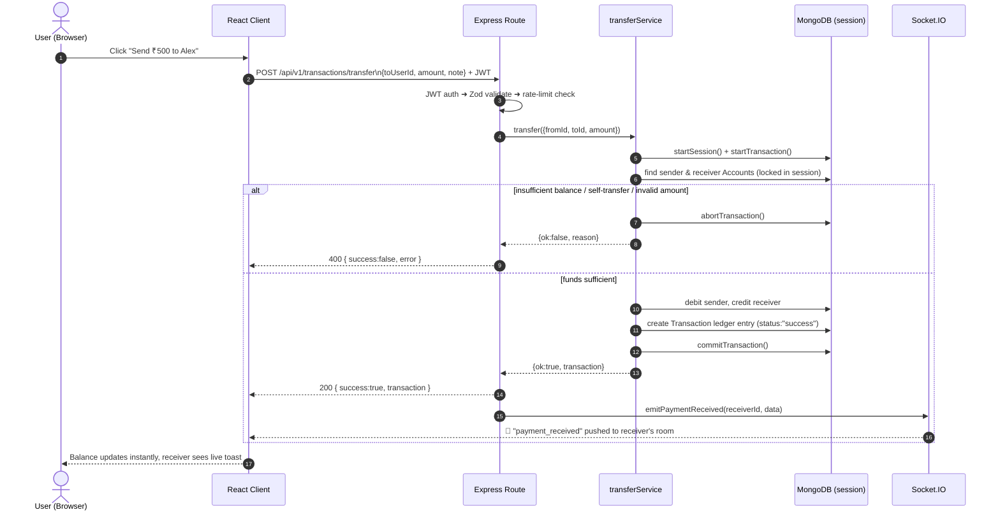
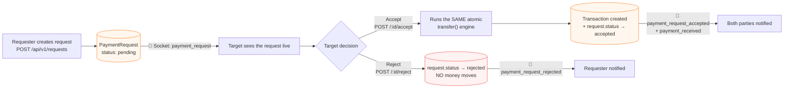
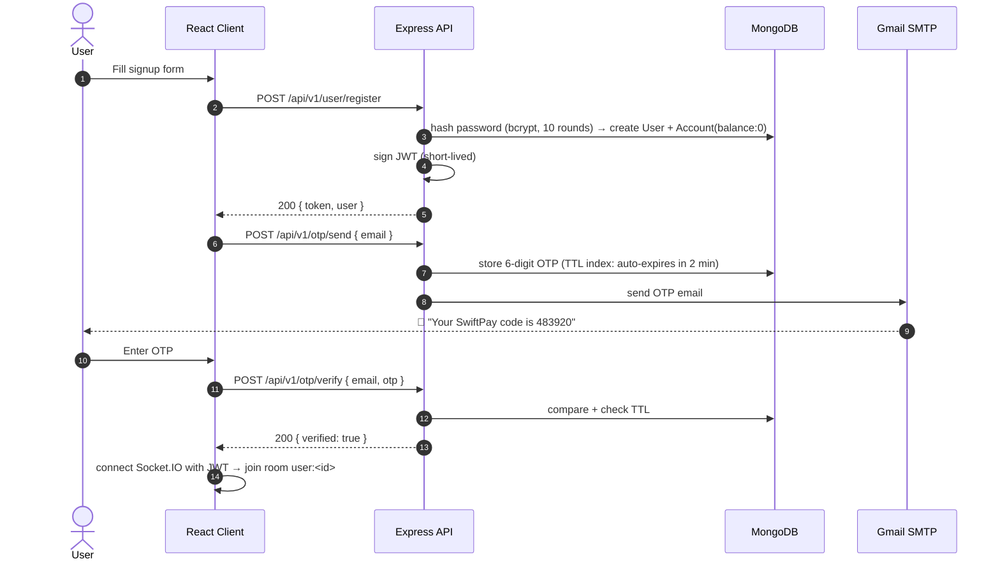
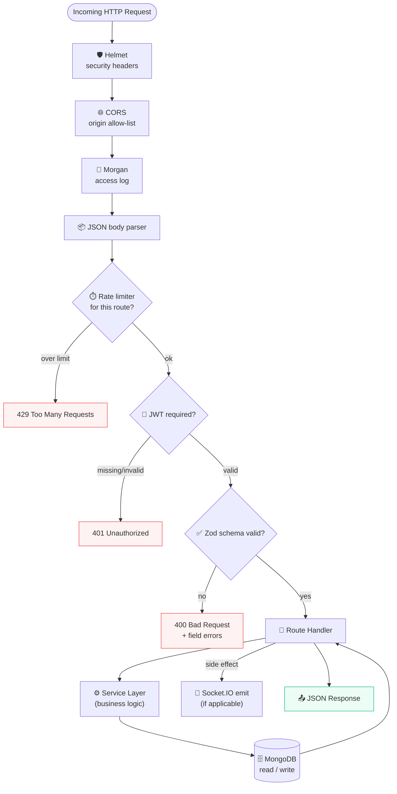
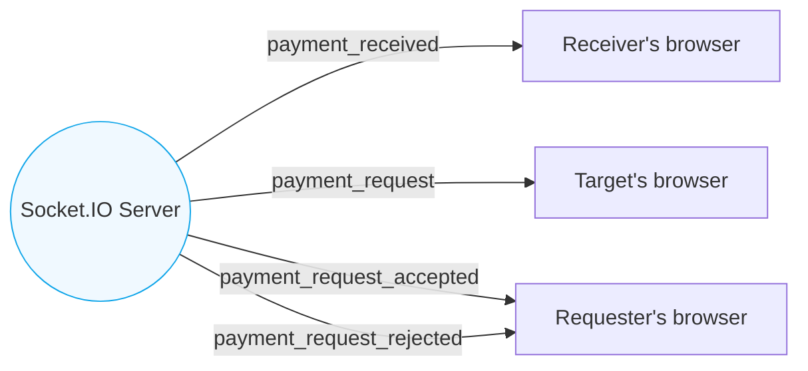

<div align="center">

# ⚡ SwiftPay

### A fast, secure, real-time peer-to-peer payment platform


**Move money between people instantly, safely, and with a full audit trail — the way a modern digital wallet should work.**

[Purpose](#-purpose) • [High-Level Design](#-high-level-design) • [Data Flow](#-data-flow) • [API Walkthrough](#-api-walkthrough--endpoint-responses) • [Strengths](#-strengths--engineering-highlights) • [Quick Start](#-quick-start)

</div>

---

## 🎯 Purpose

SwiftPay exists to answer one question well: **"How do I send money to another user, safely, and know exactly what happened?"**

It is a self-contained digital-wallet system — think of it as a teaching-grade, production-shaped clone of the core engine behind apps like Venmo, Cash App, or PayTM. Every user gets a wallet (`Account`), can transfer funds to any other user, can *request* money instead of just sending it, and can watch balances and notifications update **live**, without refreshing the page.

It was built to demonstrate — and actually enforce — the four things that matter most in any payments system:

| Concern | How SwiftPay solves it |
|---|---|
| 💰 **Money must never be created or destroyed** | Every transfer runs inside a MongoDB multi-document **ACID transaction** — debit and credit happen together, or not at all |
| 🧾 **Every movement of money must be provable** | An **immutable transaction ledger** records every transfer, request-acceptance, and refund — nothing is ever edited or deleted |
| ⚡ **Users should know instantly, not on refresh** | A **Socket.IO** real-time layer pushes balance and notification events the moment they happen |
| 🛡️ **The system must resist abuse** | Helmet headers, per-endpoint rate limiting, JWT auth, and Zod-validated input sit in front of every write path |

---

## 🏗 High-Level Design

SwiftPay is a classic **3-tier architecture**, cleanly separated so each layer can scale or be replaced independently — the React client never talks to MongoDB directly, and the API never renders HTML.



### Why this shape?

- **The React tier never mutates money directly.** It only ever calls the API and reflects whatever the API and socket layer tell it — so the UI can never get out of sync with the ledger.
- **The Service Layer is the only code path allowed to touch balances.** Routes are thin; `transferService.js` is the single choke-point where money physically moves, which is exactly where you want your one hard-to-get-wrong piece of logic to live.
- **Socket.IO is additive, not load-bearing.** If a socket drops, the REST API and database are still the source of truth — the client just re-fetches and catches up. Real-time is a UX layer sitting on top of a system that works fine without it.

---

## 🔗 How Everything Integrates



- **Frontend ↔ Backend**: Axios instance (`utils/axios.jsx`) attaches the JWT as a bearer token on every request and points at `VITE_API_URL`.
- **Backend ↔ Backend (internal)**: `index.js` wires one shared HTTP server for **both** Express routes and the Socket.IO engine — they run on the same port (`8080`), so there's only one process to deploy, scale, and monitor.
- **Backend ↔ MongoDB**: Mongoose models (`User`, `Account`, `Transaction`, `PaymentRequest`, `OTP`) talk over the standard MongoDB wire protocol; the transfer path additionally opens a **session** for multi-document transactions.
- **Backend ↔ Gmail**: `utils/mailSender.js` sends OTP and notification emails via Nodemailer using an app-specific Gmail password over TLS.
- **Docker Compose** ties all three runtime containers (`frontend`, `backend`, `mongodb`) together on one bridge network (`swiftpay-network`) so hostnames like `mongodb` and `swiftpay-backend` resolve automatically — no hardcoded IPs anywhere.

---

## 🔄 Data Flow

### 1. The money-movement flow (the heart of the system)

This is the flow every other feature (transfers, accepted requests, refunds) ultimately funnels through — `transferService.transfer()`.



**Why a session/transaction matters**: without it, a server crash between "debit sender" and "credit receiver" would silently destroy money. MongoDB's session guarantees both writes (plus the ledger entry) commit **together or not at all**.

### 2. The payment-request flow (ask, don't just send)



Payment requests **reuse** the exact same atomic transfer engine on acceptance — there is no second, less-tested code path for moving money. This is a deliberate design choice: *one* trusted function debits and credits accounts, no matter which feature triggered it.

### 3. Authentication & OTP flow



### 4. End-to-end request lifecycle, one diagram



---

## 📡 API Walkthrough & Endpoint Responses

All endpoints are mounted under `/api/v1` and (except `/health` and auth) require an `Authorization: Bearer <JWT>` header.

### `/api/v1/user` — Identity

| Method | Path | What happens | Success response |
|---|---|---|---|
| `POST` | `/register` | Hashes password (bcrypt, 10 rounds), creates `User` + zero-balance `Account`, issues JWT | `201 { token, user }` |
| `POST` | `/login` | Verifies credentials, rate-limited to 20/15 min | `200 { token, user }` |
| `GET` | `/profile` | Returns the authenticated user's profile | `200 { firstName, lastName, username, ... }` |
| `PUT` | `/profile` | Updates editable profile fields | `200 { success:true, user }` |
| `DELETE` | `/` | Deletes the user + account | `200 { success:true }` |
| `GET` | `/all-users` | Lists users (for the "pay/request someone" picker) | `200 { users: [...] }` |

### `/api/v1/transactions` — The Ledger

| Method | Path | What happens | Example response |
|---|---|---|---|
| `POST` | `/transfer` | Runs the atomic `transferService.transfer()`; strictly rate-limited to 10/min | `200 { success:true, transaction:{ id, sender, receiver, amount, status:"success", createdAt } }` |
| `GET` | `/` | Paginated ledger (sent + received), newest first | `200 { transactions:[...], page, totalPages }` |
| `GET` | `/stats` | Aggregation pipeline → totals via `$facet` | `200 { totalSent, totalReceived, count }` |
| `GET` | `/monthly` | Last 6 months grouped by sent/received, for charts | `200 { monthly:[{month, sent, received}] }` |
| `GET` | `/:id` | Single transaction — access-controlled to sender/receiver only | `200 { transaction }` |

**On failure** (e.g. insufficient funds), the transfer never partially applies — you get a clean `400`:
```json
{ "success": false, "error": "insufficient_funds" }
```

### `/api/v1/requests` — Ask for Money

| Method | Path | What happens | Example response |
|---|---|---|---|
| `POST` | `/` | Creates a `pending` `PaymentRequest`, notifies target via socket | `201 { _id, requester, target, amount, status:"pending" }` |
| `GET` | `/?type=incoming\|outgoing` | Filtered list of requests | `200 { requests:[...] }` |
| `GET` | `/:id` | Single request detail | `200 { request }` |
| `POST` | `/:id/accept` | Runs `transfer()` atomically, links `transactionId`, flips status | `200 { success:true, request, transaction }` |
| `POST` | `/:id/reject` | Flips status only — **no money moves** | `200 { success:true, request }` |

### `/api/v1/otp` — Verification

| Method | Path | What happens | Response |
|---|---|---|---|
| `POST` | `/send` | Generates 6-digit code, TTL-stored (2 min), emailed via Gmail SMTP | `200 { success:true, message:"OTP sent" }` |
| `POST` | `/verify` | Compares code + checks expiry | `200 { success:true, verified:true }` |

### `GET /health` — Liveness

```json
{ "status": "ok", "timestamp": "2026-09-06T10:00:00.000Z" }
```

### Real-time channel (Socket.IO, JWT-authenticated on connect)



Every connected client sits in its own private room, `user:<id>`, so events are routed one-to-one — no client ever receives another user's notifications.

---

## 💪 Strengths & Engineering Highlights

- 🔒 **Atomicity by construction** — `mongoose.startSession()` + `startTransaction()` around every balance change means a crash mid-transfer can never leave the ledger and the balances disagreeing.
- 🧾 **Immutable, queryable ledger** — the `Transaction` collection is append-only and compound-indexed on `{sender, createdAt}` / `{receiver, createdAt}`, so history and analytics stay fast even as it grows.
- 🧠 **One code path moves money** — both direct transfers and accepted payment requests call the exact same `transferService.transfer()`, eliminating an entire class of "the two flows drifted apart" bugs.
- 📡 **Real-time without a single point of failure** — Socket.IO is layered on top of a fully-functional REST API; if the socket disconnects, reconnection is exponential-backoff and the UI simply re-syncs from the API.
- 🛡️ **Defense in depth** — Helmet headers, an origin-restricted CORS policy, five independently-tuned rate limiters (general/auth/transfer/requests/OTP), and Zod schema validation all sit in front of business logic.
- 🔑 **Stateless, horizontally-scalable auth** — short-lived JWTs mean any backend replica can validate a request without a shared session store.
- 🐳 **One command to run anywhere** — `docker-compose up -d` brings up frontend, backend, and MongoDB, networked and health-checked, identically on a laptop or a server.
- ✅ **Tested where it counts** — Jest + Supertest + `mongodb-memory-server` cover concurrent transfers, insufficient-funds edge cases, and the full request accept/reject workflow.
- 📊 **Built-in analytics** — MongoDB aggregation pipelines (`$facet`, monthly `$group`) power the Analytics dashboard without any separate reporting service.

---

## 🧰 Tech Stack

| Layer | Technologies |
|---|---|
| **Frontend** | React 18, Vite, Redux Toolkit, Tailwind CSS, Axios, Socket.IO Client, Recharts, Framer Motion |
| **Backend** | Node.js 18, Express.js, Mongoose, JWT, Zod, Bcrypt, Socket.IO, Helmet, express-rate-limit |
| **Database** | MongoDB 7 (multi-document transactions, TTL indexes, compound indexes) |
| **Messaging** | Nodemailer over Gmail SMTP |
| **Testing** | Jest, Supertest, mongodb-memory-server |
| **DevOps** | Docker, Docker Compose, Nginx (frontend prod serve) |

---

## 🚀 Quick Start

```bash
git clone <repository-url>
cd SwiftPay
cp .env.example .env        # fill in Mongo URI, JWT secret, Gmail app password

# One command: frontend + backend + MongoDB, wired together
docker-compose up -d
```

- Frontend → **http://localhost:3000**
- Backend API → **http://localhost:8080/api/v1**
- Health check → **http://localhost:8080/health**

<details>
<summary><b>Local development (without Docker)</b></summary>

```bash
# Backend
cd backend
npm install
cp .env.example .env
npm run dev          # http://localhost:8080

# Frontend (new terminal)
cd frontend
npm install
echo "VITE_API_URL=http://localhost:8080" > .env.local
npm run dev           # http://localhost:5173
```
</details>

For full endpoint schemas, request/response payloads, and deployment notes, see [`API_REFERENCE.md`](API_REFERENCE.md), [`ARCHITECTURE.md`](ARCHITECTURE.md), and [`DOCKER.md`](DOCKER.md).

---

<div align="center">

**SwiftPay** — a small system built the way a real payments engine should be: atomic, auditable, and alive in real time.

</div>
